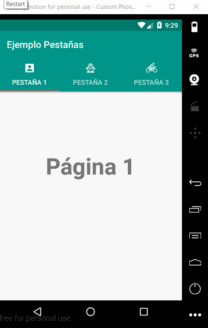

# Android
Repositorio de ejemplos de Android.

##Ejemplo Pestañas (Pestanias)
En este ejemplo usamos tres tabs, cada una apuntando a un fragmento que se ha diseñado con constraints. Cada una de las tabs posee un menu personalizado que responde a eventos de click.

